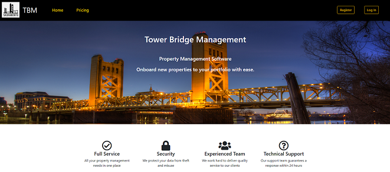
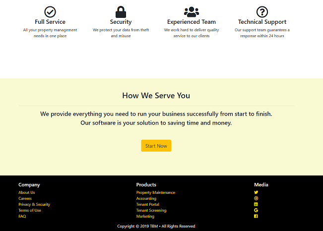
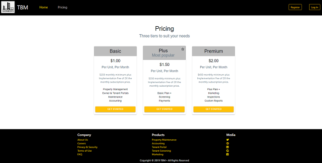

# Project 3: TBM (Tower Bridge Management)

[Presentation link]()

[TBM application link](https://polar-springs-68613.herokuapp.com/)

---

## Description

This application was written for project 3 of the UCD Coding Bootcamp. The front end was built using React, Material-UI, and CSS/CSS Bootstrap.

The landing page provides users with the opportunity to learn about the software features. Once registered/logged in, the user is directed to their dashboard where they may add rental properties to their porfolio and view the occupancy versus vacancy of each property.

---

## Technology

- AJAX
- Bcrypt
- CSS
- CSS Bootstrap
- Express
- Font Awesome
- HTML
- JSON Web Token
- JavaScript
- Material-UI
- Mysql2
- React
- Sequelize

---

## Authors and acknowledgment

- Jennifer Jones
- Muhammad Tahir
- Razina Ali

---

## Sample Views

### Homepage - Navbar

---

### Homepage - Overview & Footer

---

### Pricing

### Registration & Login

---

### Dashboard

